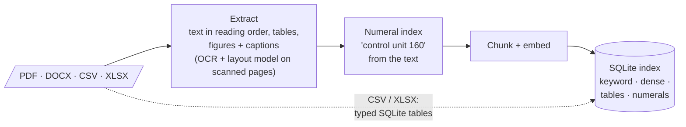
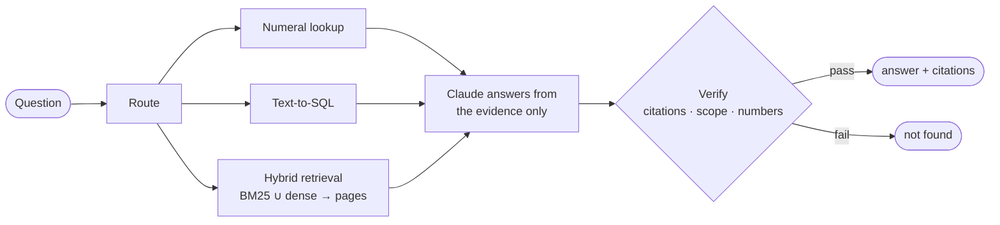

# Answer engine for engineering documents

A command-line tool that reads a folder of engineering documents (PDF and DOCX patents and
design documents, CSV/XLSX bills of materials and test logs), builds a local index, and answers
questions about them with cited answers, or says "not found" when the documents don't contain
the answer. Everything except the answering model runs on your machine with open-source
packages. The take-home brief is in `Take-Home_Answer_Engine_for_Engineering_Documents.pdf`.

## What is in the repo

| Path | Contents |
|---|---|
| `patents/`, `design_docs/`, `structured/` | **The corpus.** The nine files the brief ships: four patent PDFs (one is a scan with no text layer), two design-document PDFs, one design document DOCX, a bill of materials XLSX and a test log CSV. `make ingest` reads exactly these three directories. |
| `dev_set/questions.json` | The brief's 22 questions with reference answers and evidence pages (20 answerable, 2 unanswerable). `make eval` scores them. |
| `gold/` | Our own evaluation data: hand-transcribed OCR text, table cells, figure boxes and reading-order anchors for the corpus, 30 adversarial unanswerable questions, and the question set for the external corpus. |
| `ae/` | The code: the `ae` command (`ae/cli.py`) and the extraction, indexing, retrieval, answering and evaluation packages (module map under "Architecture"). |
| `tests/` | Unit tests (`make test`). |
| `docs/` | `extraction.md` (how extraction works) and `ai-tools.md` (how AI coding tools were used). |
| `setup.sh`, `Makefile`, `pyproject.toml`, `uv.lock`, `.env.example` | Setup and the pinned environment. |
| `data/` (created, git-ignored) | Everything the tool produces: page caches, indexes (`data/index/<name>/index.sqlite`), extraction dumps, evaluation reports (`data/eval/`), logs (`data/logs/ae.log`). |

## Quick start

Works on macOS (Homebrew) or Debian/Ubuntu (apt). `setup.sh` installs everything else.

```bash
git clone https://github.com/Ihjas-tk/swe-coding-exercise.git && cd swe-coding-exercise
./setup.sh            # installs what is missing, downloads the models, creates .env, runs `make check`
#   setup.sh asks for your Anthropic key; or edit .env afterwards:  ANTHROPIC_API_KEY=sk-ant-...
make ingest           # ~2 min: index the nine corpus files
make ask Q="What is the maximum discharge current rating of the EV-BMS-100?"
make eval             # ~3 min: run the evaluation -> data/eval/RESULTS.md
```

`make ask` prints:

```json
{"answer": "The EV-BMS-100 max discharge current is 320 A continuous, 450 A for 10 s.",
 "citations": [{"doc": "EV-BMS-100_design_document.pdf", "page": 2}],
 "not_found": false}
```

`make ingest` reads the three corpus folders and builds one index file. `make ask` and
`make eval` read that index. If something is missing, `make check` tells you what: lines marked
`!` are warnings, lines marked `✗` need fixing first. `make smoke` is an optional four-minute
self-test on one file of each type; it uses its own small index and doesn't touch the main one.

### Your own documents

Point `make ingest` at any folder (searched recursively for PDF, DOCX, CSV and XLSX), give the
index a name, and ask against that name:

```bash
mkdir -p data/try/corpus && cp design_docs/EV-BMS-100_design_document.pdf data/try/corpus/
make ingest CORPUS=data/try/corpus NAME=try
make ask NAME=try Q="What ingress protection rating does the EV-BMS-100 enclosure have?"
make ask NAME=try Q="What is the warranty period for the EV-BMS-100?"      # -> not found
```

No sorting or labelling of the files is needed: the tool works out from each file, and from
each page, what to do with it. To score your own questions, write them in the same format as
`dev_set/questions.json` and run `make eval-quick QUESTIONS=your_questions.json NAME=try`.
`make extract` dumps what extraction saw in a document (as Markdown and JSON), which is the
quickest way to understand why a question did or didn't get answered.

### How long things take

Measured on a fresh clone on an M-series MacBook (16 GB, no GPU) with an empty model cache:

| Step | Time |
|---|---|
| `./setup.sh` (dependencies and about 800 MB of models; longer if Tesseract or LibreOffice must be installed) | ~4 min |
| `make ingest` (the nine corpus files) | ~1.5 min |
| `make ask` (each call is a new process; the embedding model takes ~15 s to load) | 2–15 s |
| `make eval` (52 questions; model replies are cached, so a rerun costs nothing) | ~3 min |
| `make smoke` (optional) | ~4 min |

## What gets installed

`setup.sh` only installs what is missing, so running it twice is safe. Nothing needs `sudo`
except apt packages on Linux.

| Item | Size | Where it goes | Needed for |
|---|---|---|---|
| [uv](https://docs.astral.sh/uv/), the Python package manager | ~40 MB | `~/.local/bin` | everything (it also fetches Python 3.12 if you don't have it) |
| Tesseract 5 with English data | ~40 MB | Homebrew / apt | reading scanned pages and figure labels |
| LibreOffice (optional) | ~700 MB (Homebrew) / ~300 MB (apt) | Homebrew / apt | page numbers for DOCX files; without it DOCX citations say page 1. Skip with `SKIP_LIBREOFFICE=1 ./setup.sh` |
| Python packages (pinned in `uv.lock`) | ~1.3 GB | `.venv/` in the repo | everything |
| Embedding model (granite-embedding-english-r2) | ~290 MB | Hugging Face cache | search |
| Docling layout models | ~500 MB | Hugging Face cache | tables and figures on scanned pages |
| `.env` | — | repo root, git-ignored | your API key |
| Caches, indexes, reports, logs | a few hundred MB | `data/` | created as you use the tool |

The Hugging Face cache is `~/.cache/huggingface/hub` unless you have set `HF_HOME`. `make models`
downloads the models ahead of time and `make check` reports whether they are present.

## Configuration

The only thing you have to set is your Anthropic API key, in `.env` at the repo root.
`setup.sh` creates that file and offers to fill the key in. Everything else has a sensible
default. If you want to change which Claude models are used, which embedding model, or where
the index lives, `.env.example` lists the settings with one line of explanation each. Without a
key you can still build the index; asking and evaluating need it.

## Commands

`make help` prints this list from the Makefile.

| Target | What it does |
|---|---|
| `make setup` | runs `./setup.sh`: uv, Tesseract, LibreOffice, pinned deps, `.env`, models, `ae check` (re-runnable) |
| `make models` | pre-download the embedding model (`EMBED`) and the Docling layout models into the HF cache |
| `make check` | verify Tesseract, LibreOffice, Python packages, `uv.lock`, `.env` + API key, cached models, the index |
| `make smoke` | optional ~4 min self-test on one file of each type in its own index (ingest + ask + score 16 dev questions) |
| `make extract` | extraction only; dumps `data/extracted/` (JSON + Markdown per document; figure crops in `data/extracted/figures/`) |
| `make structured` | load CSV/XLSX into SQLite and print the schema the LLM sees |
| `make ingest` | index `patents/`, `design_docs/`, `structured/` (or `CORPUS=<dir>` into `NAME=<index>`): extract + structured + numerals + chunk + index + embeddings (+ figure descriptions when `VLM=1`) |
| `make ingest-nodense` | same, without embeddings (no embedding model needed) |
| `make ask Q="..."` | answer one question (`DEBUG=1` adds routing/retrieval/verification details; `NAME=<index>` for a custom corpus) |
| `make eval` | full staged evaluation of the built-in corpus -> `data/eval/RESULTS.md` (builds the index first if it is missing) |
| `make eval-quick` | answer a question file and score it: `QUESTIONS=<file> NAME=<index>` (default: the dev set on the default index) |
| `make eval-fast` | extraction + retrieval stages only (no LLM calls) |
| `make external` | fetch the external evaluation corpus, ingest it (index `ext`) and score it -> `data/eval/EXTERNAL.md` |
| `make test` | unit tests (the integration tests need `make ingest` and skip without it) |
| `make lint` / `make fmt` | ruff format check + lint + mypy / apply the formatter and safe lint fixes |
| `make clean-cache` | delete page caches and extraction dumps (indexes and the LLM/VLM/embedding caches are kept) |

Lower-level commands are in `uv run ae --help` (e.g. `ae search`, `ae show`, `ae eval --quick`).
The OmniDocBench slice is not downloaded by a target: with the subset annotations and images in
`data/external/omnidocbench/`, run `uv run ae prep-external` and
`uv run ae extract data/external/omnidocbench/pdfs/*.pdf --out data/external/omnidocbench/extracted`;
`make eval` then adds its rows.

## Troubleshooting

| Symptom | Cause and fix |
|---|---|
| Every question comes back `"not_found": true`, and the log says the API key is not set | Put `ANTHROPIC_API_KEY=...` in `.env`. `make check` shows which `.env` file is being read. |
| `make check` says Tesseract is missing, or its English data is missing | macOS: `brew install tesseract`. Debian/Ubuntu: `sudo apt-get install tesseract-ocr tesseract-ocr-eng`. |
| `make check` says LibreOffice is missing; DOCX citations all say page 1 | Optional. `brew install --cask libreoffice` or `sudo apt-get install libreoffice-writer`, then run `make ingest` again. |
| The Homebrew step is very slow | `HOMEBREW_NO_AUTO_UPDATE=1 ./setup.sh` skips Homebrew's own update. `SKIP_LIBREOFFICE=1 ./setup.sh` skips the largest download. |
| Model download fails (proxy, firewall) | Set `HF_ENDPOINT` to a reachable mirror and run `make models`, or copy `~/.cache/huggingface/hub` from another machine and set `HF_HUB_OFFLINE=1`. |
| "no index at data/index/default/index.sqlite" | Run `make ingest`. `make smoke` builds a separate index and doesn't create this one. |
| API timeouts or "overloaded" errors | Calls time out after two minutes and are retried twice. A question that still fails comes back as `not_found` with the error shown under `DEBUG=1`. Successful replies are cached, so re-running `make eval` only re-sends the failures. |
| `make check` says the environment is out of sync with `uv.lock` | Run `uv sync`. |
| `uv: command not found` right after setup | Open a new shell, or `export PATH="$HOME/.local/bin:$PATH"`. |

The console shows progress at INFO level; the full log is in `data/logs/ae.log`.

## Architecture

`make ingest` turns a folder of files into one SQLite index:



`make ask` answers from that index and nothing else:




## Choices and why

| Choice | Why |
|---|---|
| Our own PDF extraction (PyMuPDF, pdfplumber, Tesseract), with Docling used only for tables and figures on scanned pages | On pages with a text layer, our own extraction gives exact text and positions and is small enough to explain line by line. Docling's text on the scanned patent duplicated regions, so we use its layout model only for the one thing we can't do ourselves: finding tables and figures in pixels. |
| Tesseract as the only OCR engine | On the scanned patent its text is close to perfect, and the duplication problem with Docling turned out not to be about the OCR engine. |
| Reference numerals from the text, not from the drawings | Patent specifications define every numeral they draw; reading numerals off the drawings is error-prone. |
| Table rows as their own chunks, each prefixed with the document and section | Most table questions hinge on one row; splitting by row was the single biggest retrieval gain we measured. |
| Keyword search and embedding search combined | Part numbers and figure ids need exact matching; paraphrased questions need meaning. Neither alone covered both. |
| granite-embedding-english-r2 | Open licence, strong on tables, and it beat the smaller alternative on our questions. |
| Claude Sonnet for answers and SQL, Haiku for figure descriptions and grading | Image input is needed for figures; the cheaper model is enough for one-off descriptions and for grading. |
| SQLite for everything | Text search, embeddings, structured tables and the numeral index in one file, with nothing to run. |
| Answering is checked, not trusted | Models answer unsupported questions when merely told not to. Deterministic checks on citations, scope and numbers are what actually stop wrong answers. |

### How the stack was chosen

The pipeline was picked by measuring alternatives on the dev set, the extraction gold set, the
OmniDocBench slice and the external corpus. The comparison code (a Docling-only extraction
path, a native-only path without the layout pass, a second OCR engine, keyword-only and
embedding-only retrieval, and the chunking and embedding-model ablations) was removed once the
decision was made, so the submission contains only the chosen pipeline. The numbers below are
from the last run before removal; re-running them needs the code at commit e805777.

Extraction (`native` = our own extraction alone; `docling` = Docling for everything, with
Tesseract as its OCR engine; `native + layout` = the chosen pipeline):

| Metric | native | docling | native + layout (chosen) |
|---|---|---|---|
| OCR CER / WER (scanned patent page) | 0.0013 / 0.0080 | 0.2182 / 0.2122 | 0.0013 / 0.0080 |
| Table cell accuracy (4 tables, 117 cells) | 0.983 | 0.966 | 0.983 |
| Figures found / caption linked (9) | 9/9 / 9/9 | 9/9 / 3/9 | 9/9 / 9/9 |
| Figure label recall, Tesseract | 0.39 | 0.10 | 0.39 |
| Reading order pair accuracy (3 two-column pages) | 0.903 | 0.942 | 0.903 |
| OmniDocBench (106 scanned pages): text similarity | 0.749 | 0.837 | 0.733 |
| OmniDocBench: reading order pair accuracy | 0.948 | 0.979 | 0.940 |
| OmniDocBench: table TEDS (19 tables) | 0.00 | 0.534 | 0.534 |
| OmniDocBench: figure recall @ IoU 0.5 (50 figures) | 0.00 | 0.72 | 0.72 |
| Dev set answers correct / cited page in gold | 20/20 / 18/20 | 20/20 / 18/20 | 20/20 / 18/20 |
| External corpus: correct (44) / cited page (44) | 40 / 42 | 38 / 38 | 40 / 42 |

The OmniDocBench rows were scored on extraction dumps made before the final refactor; with the
final code the chosen pipeline scores 0.738 / 0.945 / 0.534 / 0.74 (see Results).

Other comparisons, in brief: a second OCR engine inside Docling (EasyOCR) duplicated the same
regions as Tesseract did, so the fault is Docling's layout step, not the OCR. Embedding-only
retrieval was one question better than the combination at Recall@5, but the combination keeps
exact matching for part numbers and figure ids, and one question is within the noise of a
20-question set. The smaller embedding model (bge-small) was ten points behind at Recall@1.
Dropping the per-row table chunks cost two of the seven table questions.

## Results

All numbers come from `make eval` (`data/eval/RESULTS.md` has every breakdown). The dev set has
20 answerable and 2 unanswerable questions; we added 30 adversarial unanswerable questions, an
extraction gold set for the corpus, and 106 scanned pages from OmniDocBench. A full eval makes
about a hundred model calls (roughly 60 to Sonnet, 40 to Haiku); replies are cached, so a rerun without code changes makes none.

| Metric | Value |
|---|---|
| Extraction: OCR CER / WER (scanned patent page) | 0.0013 / 0.0080 |
| Extraction: table cell accuracy (4 tables, 117 cells) | 0.983 |
| Extraction: figures found / caption linked (9) | 9/9 / 9/9 |
| Extraction: figure label recall, Tesseract / VLM | 0.39 / 0.93–0.96 (VLM descriptions vary slightly between runs) |
| Extraction: reading order pair accuracy (3 two-column pages) | 0.903 |
| OmniDocBench (106 scanned pages): text similarity | 0.738 |
| OmniDocBench: reading order pair accuracy | 0.945 |
| OmniDocBench: table TEDS (19 tables) | 0.534 |
| OmniDocBench: figure recall @ IoU 0.5 (50 figures) | 0.74 |
| Retrieval: page Recall@1 / @5 | 0.75 / 0.90 |
| Answers: correct (20 answerable; numbers within 1 % + LLM grader + read by hand) | 20/20 |
| Answers: cited page in gold evidence | 18/20 |
| Answers: citation precision | 0.775 |
| Answers: wrong declines on answerable | 0 |
| Not-found: handled correctly (2 dev + 30 adversarial) | 32/32 |
| Penalty score (+1 correct / 0 declined / −2 wrong) | 20 of 20 |

Retrieval by question type at Recall@5: factual 5/5, table 6/7, figure 3/4, structured 4/4;
every gold page is in the top 10. With 20 questions, one question is 5 points.

### Failure analysis

What still fails or differs after the fixes, and why:

| Case | What went wrong | Stage |
|---|---|---|
| q02 and q07: cited page differs from the dev set | Both answers are correct. We cite the page where the fact is printed (page 1 of the scanned patent, page 2 of the BMS document); the dev set cites the next page in each case. Left as is. | gold label |
| q12 and q16: answer spans two pages | The RJA-40 spec table splits across pages 1–2 under LibreOffice, and the BMS figure sits on page 2 with its caption on page 3. We cite every page a split table spans and a figure's caption page too, which keeps the gold page in the citations and is why citation precision is 0.775 rather than 1. | citation policy |
| Falcon-VT1 "Processor" row (2 of 117 gold cells) | The PDF prints "MHz" and "with" on top of each other; every parser splits it the same way. | corpus defect |
| Figure numerals read by Tesseract (recall 0.39) | Leader lines touching a "1" turn 100/110/120 into 00/10/20. Worked around: numerals come from the specification text, and the figure description reads them. | extraction |
| OmniDocBench text similarity 0.738 | Tesseract on dense two-column scans. Docling's own text scored higher there but duplicated regions on our patent, so it isn't used. | extraction (scans) |

Assumptions that differ from the dev set, written down rather than special-cased: the page
differences above; CSV and XLSX files are cited as page 1; a figure's citation includes its
caption page; a split table's citation includes every page it spans.

### External corpus (real documents)

To find the gaps the synthetic corpus can't show, we also ran 11 real files (two Google Patents
grants, a Microchip datasheet, a NASA paper, an arXiv paper, 12 ICDAR 2013 table pages, two
scanned NASA reports, a CubeSat DOCX procedure, an open-hardware BOM and the UCI SECOM test log)
with 52 hand-written questions (`gold/external_questions.json`, `make external`). Final score:
40/44 answerable correct, 42/44 cited pages, 8/8 unanswerable declined. The first pass scored
33/44; the ten problems fixed in between were mostly in spreadsheet handling (header rows,
unnamed columns, mixed-type columns, very wide schemas, totals rows) and DOCX page mapping. The
four still open: superscripts lost in OCR'd text layers, numbers that exist only inside a
figure, a sentence outranked by many short table rows, and picking the right drawing sheet
when a patent has many. `make external` reproduces the run (`data/eval/EXTERNAL.md`).

## Known limitations

- Tables and figures on scanned pages depend entirely on Docling's layout model; if it misses
  one, nothing else will find it.
- A page whose text layer is wrong but looks plausible is trusted, so it is neither OCR'd nor
  sent through the layout model.
- Page numbers for DOCX files follow LibreOffice's rendering, which can differ from Word's.
- Long documents are slow: embedding runs at about 50 ms per chunk on a laptop CPU, and Docling
  converts the whole document as soon as one page needs OCR.
- The evaluation is small: 20 answerable questions, so one question moves a score by 5 points,
  and the unanswerable set was written by us.

## With more time

Things I would look into further:

1. Whether Docling is the best choice for the layout work on scanned pages, and whether
   Tesseract is the best choice for scanned text.
2. Why Docling duplicates regions on the scanned patent, since fixing that would let its
   stronger scanned-page text be used.
3. Running the layout model only on the pages that need it, and a faster embedding path, so a
   100-page document takes minutes rather than a quarter of an hour.
4. Retrieval under harder conditions: more documents, near-duplicates, and a reranking step.
5. Tuning the not-found thresholds on a larger unanswerable set.

## AI coding tools

See `docs/ai-tools.md`.
